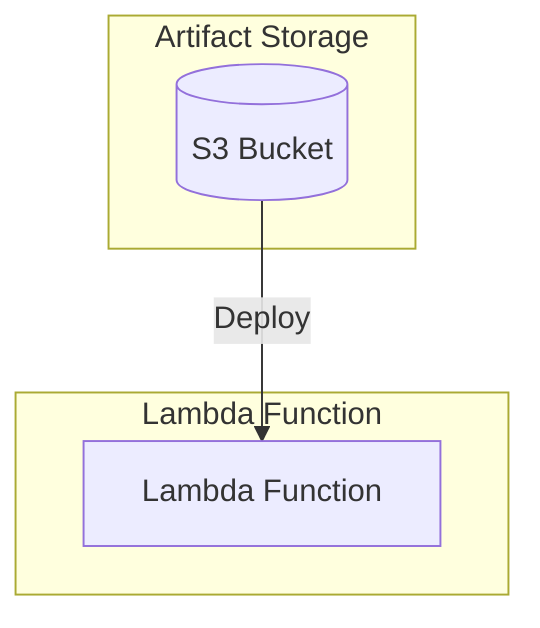

# Decoupled Lambda Service Stack Example

This is an example of how to use the following units in a stack:

- [lambda-decoupled-service](/units/lambda-decoupled-service) - Deploys an AWS Lambda function with S3 artifact storage
- [lambda-artifact-s3-bucket](/units/lambda-artifact-s3-bucket) - Sets up an S3 bucket for storing Lambda function artifacts

## Usage

1. Navigate to the example directory:

   ```bash
   cd examples/terragrunt/stacks/decoupled-lambda-service
   ```

2. Run the following command to deploy the service:

   ```bash
   terragrunt stack run apply
   ```

3. After deployment, you can invoke the Lambda function using the AWS CLI or console.

   ```bash
   terragrunt stack output
   ```

## Infrastructure Diagram



## Components

### Lambda Function

- Runtime: Amazon Linux 2023 (provided.al2023)
- Memory: 128 MB
- Timeout: 3 seconds
- Handler: bootstrap
- Source code packaged in handler.zip
- Artifact stored in dedicated S3 bucket

### S3 Bucket

- Bucket name includes service name suffix (-s3)
- Stores Lambda function artifacts
- Force destroy enabled for cleanup
- Handles artifact packaging and deployment

## Configuration

The stack uses the following default configuration (customizable through `terragrunt.stack.hcl`):

```hcl
locals {
  name = "decoupled-lambda-service"
  s3_key = "handler.zip"
}

// Lambda configuration
runtime    = "provided.al2023"
memory     = 128
timeout    = 3
source_dir = "./src"
handler    = "bootstrap"

// S3 configuration
force_destroy = true
```

## Prerequisites

- AWS credentials configured
- Terragrunt installed
- Golang for building the Lambda function binary
- Access to the source code and package script

## Cleanup

To destroy all resources created by this stack:

```bash
terragrunt stack run destroy
```
