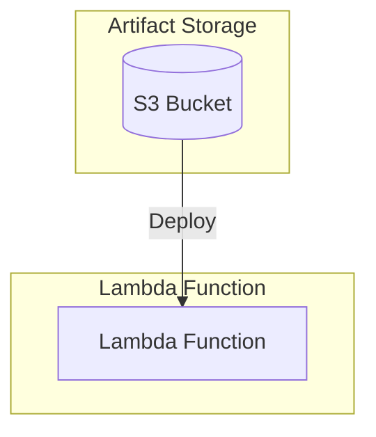

# Decoupled Lambda Service Stack Example

This is an example of how to use the following units in a stack:

- [lambda-decoupled-service](/units/lambda-decoupled-service) - Deploys an AWS Lambda function with S3 artifact storage
- [lambda-artifact-s3-bucket](/units/lambda-artifact-s3-bucket) - Sets up an S3 bucket for storing Lambda function artifacts

## What is a decoupled service?

A "decoupled service", as described in this context, is a service with application code that is deployed independently of the Infrastructure as Code (IaC) that provisions it. This is in contrast to "tightly coupled" services, where the service is only deployed via the IaC that provisions it.

Both approaches have their trade-offs, and the choice to leverage one approach or the other depends on the specific needs of the service and organization.

### Advantages of a decoupled service

- **Separation of concerns.** The service is deployed independently of the IaC, so it can be deployed at any time without waiting for the IaC to be updated and deployed.
- **Reduced Blast Radius.** Deployments are limited to updating the service code (or a small number of additional configurations), so the risk of completely destroying or corrupting the underlying infrastructure is reduced.
- **Flexibility.** The service can be deployed independently of the IaC, so it can be deployed in any environment (e.g., development, staging, production).
- **Speed.** Deploying IaC with OpenTofu/Terraform and Terragrunt requires downloading OpenTofu/Terraform providers, modules, etc. which can take a while. IaC also inherently involves comparing the desired state of infrastructure with the actual, current state of infrastructure, which can be time-consuming (especially when there are a lot of resources managed by the IaC).
- **Ease of deployment.** Knowing IaC can be a barrier to entry for some teams, so a decoupled service can allow application developers to focus on the application code, and the deployment process, while leaving the infrastructure management to the infrastructure/platform team.

### Disadvantages of a decoupled service

- **Complexity.** Deploying a decoupled service requires a separate deployment process, which adds complexity to the overall deployment process. It also requires using additional tooling to manage the deployment process outside of IaC.
- **Potential for drift.** Since the service is deployed independently of the IaC, there is a potential for drift to occur between the service and the IaC. This can make it harder to ensure that the service is always in a known state, and that the IaC is reflecting the current state of the service.
- **Bootstrapping complexity.** The service must be bootstrapped with some initial data or state, and this must be done in a way that is compatible with the deployment process (e.g. in this example, the service is bootstrapped with a zip file containing the source code of the application). This bootstrapping must be reliably reproducible, even when the service is deployed in a new environment, or rebuilt from scratch.
- **Delayed integration.** Since the service is deployed independently of the IaC, it can be difficult to integrate a change to the application code of the service with a change to the underlying infrastructure. If, for example, the service is being deployed with adjusted dependencies that use different a different CPU architecture, or require different IAM permissions, changes must be scheduled such that the application code is not updated until the requisite infrastructure is adjusted to support those changes.

### When should you use a decoupled service?

- When the application code is not tightly coupled to the underlying infrastructure that provisions it.
- When the developers working on the application code are inexperienced with IaC or are not comfortable with it.
- When a different level of access is required for application code and infrastructure code.
- When the application code needs to be deployed in a manner that's agnostic to the underlying infrastructure (e.g. The service is deployed by pushing a container image to a container registry, and the infrastructure team wants to have control over how and where the container is deployed).

## Usage

1. Navigate to the example directory:

   ```bash
   cd examples/terragrunt/stacks/decoupled-lambda-service
   ```

2. Run the following command to deploy the service:

   ```bash
   terragrunt stack run apply
   ```

3. After deployment, you can invoke the Lambda function using the AWS CLI or console.

   ```bash
   terragrunt stack output
   ```

## Infrastructure Diagram



## Components

### Lambda Function

- Runtime: Amazon Linux 2023 (provided.al2023)
- Memory: 128 MB
- Timeout: 3 seconds
- Handler: bootstrap
- Source code packaged in handler.zip
- Artifact stored in dedicated S3 bucket

### S3 Bucket

- Bucket name includes service name suffix (-s3)
- Stores Lambda function artifacts
- Force destroy enabled for cleanup
- Handles artifact packaging and deployment

## Configuration

The stack uses the following default configuration (customizable through `terragrunt.stack.hcl`):

```hcl
locals {
  name = "decoupled-lambda-service"
  s3_key = "handler.zip"
}

// Lambda configuration
runtime    = "provided.al2023"
memory     = 128
timeout    = 3
source_dir = "./src"
handler    = "bootstrap"

// S3 configuration
force_destroy = true
```

## Prerequisites

- AWS credentials configured
- Terragrunt installed
- Golang for building the Lambda function binary
- Access to the source code and package script

## Cleanup

To destroy all resources created by this stack:

```bash
terragrunt stack run destroy
```
