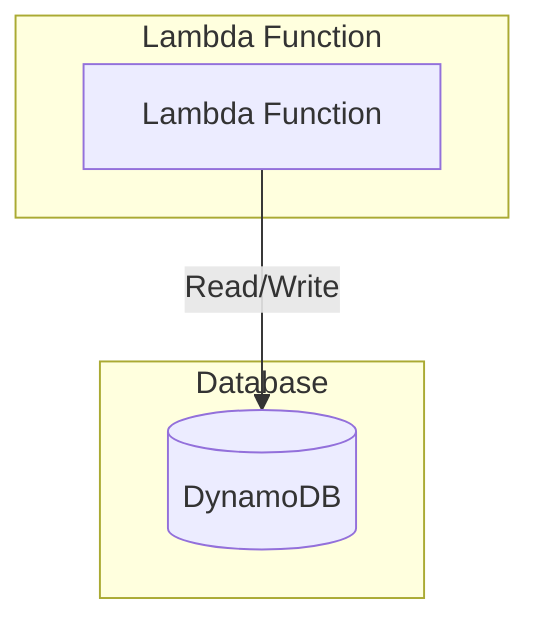

# JS Stateful Lambda Service Stack Example

This is an example of how to use the following units in a stack:

- [js-lambda-stateful-service](/units/js-lambda-stateful-service) - Deploys a Node.js AWS Lambda function with DynamoDB integration
- [dynamodb-table](/units/dynamodb-table) - Sets up a DynamoDB table for persistent storage
- [lambda-iam-role-to-dynamodb](/units/lambda-iam-role-to-dynamodb) - Configures an IAM role that allows Lambda to interact with DynamoDB

## Usage

1. Navigate to the example directory:

   ```bash
   cd examples/terragrunt/stacks/js-stateful-lambda-service
   ```

2. Run the following command to deploy the service:

   ```bash
   terragrunt stack run apply
   ```

3. After deployment, you can invoke the Lambda function using the AWS CLI or console.

   ```bash
   terragrunt stack output
   ```

## Infrastructure Diagram



## Components

### Lambda Function

- Runtime: Node.js 24.x (nodejs24.x)
- Memory: 128 MB
- Timeout: 3 seconds
- Handler: index.handler
- Source code packaged in handler.zip

### DynamoDB Table

- Table name includes service name suffix (-db)
- Primary key: Id (String)
- On-demand capacity mode
- Serverless, fully managed NoSQL database

### IAM Role

- Dedicated IAM role for Lambda execution
- Permissions to interact with the DynamoDB table
- Follows principle of least privilege

## Configuration

The stack uses the following default configuration (customizable through `terragrunt.stack.hcl`):

```hcl
locals {
  name = "js-stateful-lambda-service"
}

// Lambda configuration
runtime    = "nodejs24.x"
memory     = 128
timeout    = 3

// DynamoDB configuration
hash_key      = "Id"
hash_key_type = "S"
```

## Prerequisites

- AWS credentials configured
- Terragrunt installed

## Cleanup

To destroy all resources created by this stack:

```bash
terragrunt stack run destroy
```
