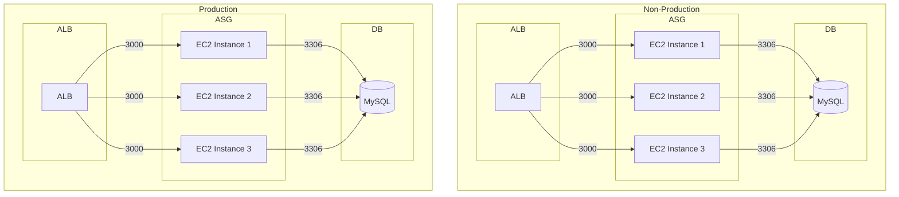

# Multi-Environment Stateful ASG Services Example

This example demonstrates how to deploy stateful web services using EC2 Auto Scaling Groups (ASG) with an Application Load Balancer (ALB) in AWS across multiple environments. The services run on Amazon Linux 2023 and automatically scale based on demand while maintaining state through a MySQL database.

## Architecture

The example deploys:

- Multiple EC2 Auto Scaling Groups with Amazon Linux 2023 instances
- Application Load Balancers to distribute traffic
- MySQL databases for persistent storage
- Security groups for the ALB, EC2 instances, and database
- IAM roles and policies for the EC2 instances
- Security group rules controlling access between ASG and MySQL

## Configuration

The example is configured through a single unit in `terragrunt.stack.hcl` with the following parameters:

| Parameter | Description | Default |
|-----------|-------------|---------|
| `name` | Name of the service and associated resources | `stateful-asg-service` |
| `instance_type` | EC2 instance type | `t4g.micro` |
| `min_size` | Minimum number of instances in the ASG | `2` |
| `max_size` | Maximum number of instances in the ASG | `4` |
| `server_port` | Port on which the application listens | `3000` |
| `alb_port` | Port on which the ALB listens | `80` |
| `db_port` | Port on which MySQL listens | `3306` |

## Implementation Details

The service runs on Amazon Linux 2023 (ARM64) and maintains state through a MySQL database. The configuration is provided through a user data script that:

1. Sets up the application environment
2. Configures the application to connect to the MySQL database
3. Starts the application service

## Usage

To deploy this example:

1. Navigate to the example directory:

   ```bash
   cd examples/terragrunt/multi-env-stateful-asg-services
   ```

2. Run the following command to deploy the service:

   ```bash
   terragrunt stack run apply
   ```

3. After deployment, you can access the service through the ALB's DNS name, which will be shown in the output.

   ```bash
   terragrunt stack run output
   ```

## Infrastructure Diagram



Components (per environment):

- Application Load Balancer (ALB) listening on port 80 and forwarding traffic to the ASG on port 3000
- EC2 Auto Scaling Group (ASG) with multiple instances running the application
- MySQL database (DB) for persistent storage
- Security group rules controlling access between ASG and MySQL on port 3306
- IAM roles and policies for the EC2 instances

## Environment Management

This example supports multiple environments (non-prod and prod) via re-usable stacks.

Each environment can have its own:

- Resource naming conventions
- Instance types and sizes
- Scaling policies
- Database configurations
- Security group rules

## Cleanup

When you're done testing, you can destroy the infrastructure:

```bash
terragrunt stack run destroy
```
