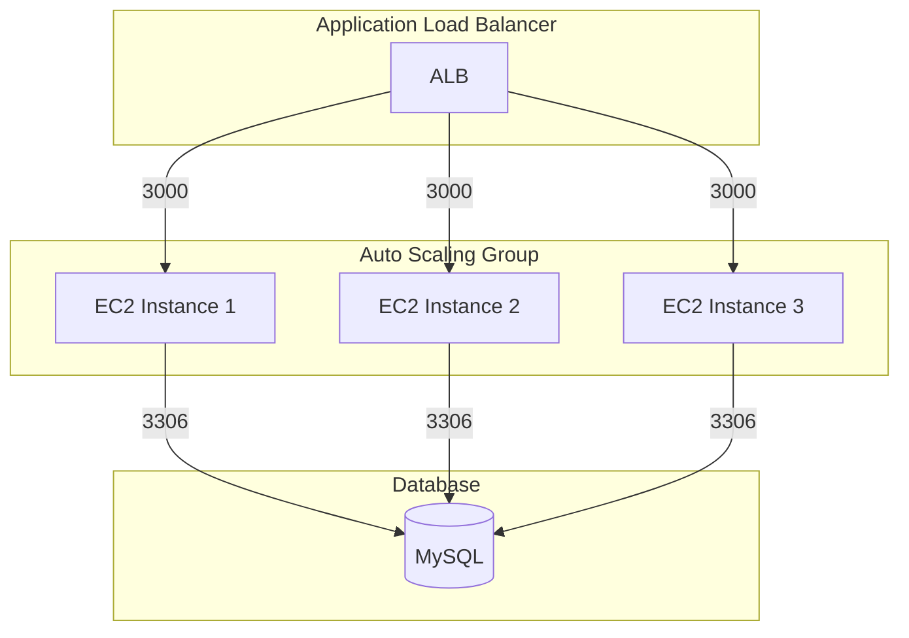

# Stateful ASG Service Example

This is an example of how to use the following units in a stack:

- [mysql](/units/mysql) - Sets up a MySQL RDS instance for persistent storage
- [ec2-asg-stateful-service](/units/ec2-asg-stateful-service) - Deploys an EC2 Auto Scaling Group running a Bun application
- [asg-to-db-sg-rule](/units/asg-to-db-sg-rule) - Configures security group rules to allow ASG instances to connect to MySQL

## Quick start

1. Open `terragrunt.stack.hcl` and update values as necessary:
   - `db_username` and `db_password` for MySQL credentials
   - `instance_type` for EC2 instances (default: t4g.micro)
   - `min_size` and `max_size` for ASG scaling limits
   - `server_port` and `alb_port` for application ports

2. Run `terragrunt stack run apply`

## Infrastructure Diagram



## Components

### Application Load Balancer

- Listens on port 80 (configurable via `alb_port`)
- Forwards traffic to EC2 instances on port 3000 (configurable via `server_port`)
- Provides high availability and load balancing

### EC2 Auto Scaling Group

- Runs multiple EC2 instances (min 2, max 4 by default)
- Each instance runs a Bun application
- Application features:
  - REST API endpoints for movie data
  - Uses Drizzle ORM for database operations
  - Automatically runs migrations and seeds initial data
  - Endpoints:
    - `GET /` - Health check
    - `GET /movies` - List all movies
    - `GET /movies/:id` - Get movie by ID

### Database

- MySQL RDS instance for persistent storage
- Stores movie data in a `movies` table
- Security group rules allow access from ASG instances on port 3306

## Cleanup

When you're done testing, you can destroy the infrastructure:

```bash
terragrunt stack run destroy
```
