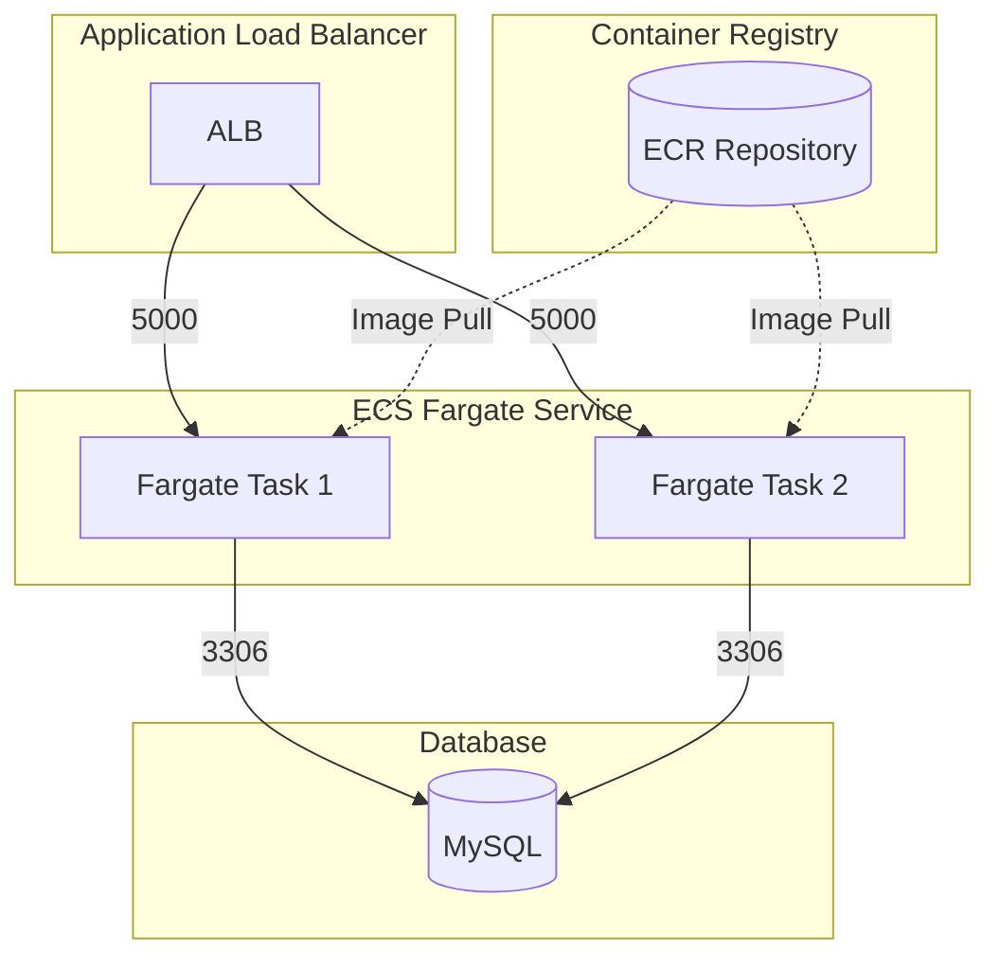

# Stateful ECS Service Stack Example

This is an example of how to use the following units in a stack:

- [ecs-fargate-stateful-service](/units/ecs-fargate-stateful-service) - Deploys a stateful ECS Fargate service with an Application Load Balancer (ALB)
- [mysql](/units/mysql) - Sets up a MySQL RDS instance for persistent storage
- [service-to-db-sg-rule](/units/service-to-db-sg-rule) - Configures security group rules to allow ECS tasks to connect to MySQL
- [ecr-repository](/units/ecr-repository) - Creates an ECR repository for container images

## Usage

1. Navigate to the example directory:

   ```bash
   cd examples/terragrunt/stacks/stateful-ecs-service
   ```

2. Run the following command to deploy the service:

   ```bash
   terragrunt stack run apply
   ```

3. After deployment, you can access the service through the ALB's DNS name, which will be shown in the output.

   ```bash
   terragrunt stack output
   ```

## Infrastructure Diagram



## Components

### Application Load Balancer

- Listens on port 80 (configurable via `alb_port`)
- Forwards traffic to Fargate tasks on port 5000 (configurable via `container_port`)
- Provides high availability and load balancing

### ECS Fargate Service

- Runs multiple Fargate tasks (2 desired tasks by default)
- Task configuration:
  - CPU: 256 units
  - Memory: 512 MB
  - Container Port: 5000
- Auto-scaling capabilities based on CPU/Memory utilization
- Automatically builds source code and pushes container images to ECR

### Database

- MySQL RDS instance for persistent storage
  - Instance Class: db.t4g.micro
  - Storage: 20GB GP2
- Security group rules allow access from ECS tasks on port 3306

### ECR Repository

- Stores container images for the service
- Configured with force delete for easy cleanup
- Supports image lifecycle policies

## Configuration

The stack uses the following default configuration (customizable through `terragrunt.stack.hcl`):

```hcl
locals {
  db_username = "admin"
  db_password = "password"

  cpu            = 256
  memory         = 512
  container_port = 5000

  name = "stateful-ecs-service-stack"
}
```

> **Note**: The database credentials in this example are for demonstration purposes only. In a production environment, you should use secure password management and avoid storing credentials in plain text.

## Prerequisites

- AWS credentials configured
- Terragrunt installed
- Docker installed (for building and pushing container images)

## Cleanup

To destroy all resources created by this stack:

```bash
terragrunt stack run destroy
```
