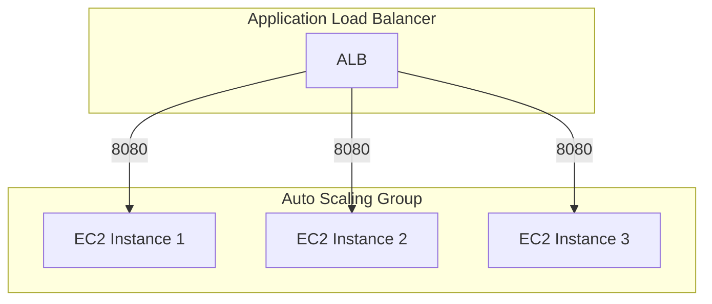

# EC2 Auto Scaling Group Service Example

This example demonstrates how to deploy a simple web service using an EC2 Auto Scaling Group (ASG) with an Application Load Balancer (ALB) in AWS. The service runs Nginx on Amazon Linux 2023 and automatically scales based on demand.

## Usage

To deploy this example:

1. Navigate to the example directory:

   ```bash
   cd examples/terragrunt/units/ec2-asg-service
   ```

2. Run the following command to deploy the service:

   ```bash
   terragrunt apply
   ```

3. After deployment, you can access the service through the ALB's DNS name, which will be shown in the output.

   ```bash
   terragrunt output
   ```

## Estimated Time to Deploy

In a local test, the service took about 20 seconds to startup after applying.

## Architecture

The example deploys:

- An EC2 Auto Scaling Group with Amazon Linux 2023 instances
- An Application Load Balancer to distribute traffic
- Security groups for the ALB and EC2 instances
- IAM roles and policies for the EC2 instances

## Configuration

The example is configured through a single unit in `terragrunt.stack.hcl` with the following parameters:

| Parameter       | Description                                  | Default           |
|-----------------|----------------------------------------------|-------------------|
| `name`          | Name of the service and associated resources | `ec2-asg-service` |
| `instance_type` | EC2 instance type                            | `t4g.micro`       |
| `min_size`      | Minimum number of instances in the ASG       | `2`               |
| `max_size`      | Maximum number of instances in the ASG       | `4`               |
| `server_port`   | Port on which Nginx listens                  | `8080`            |
| `alb_port`      | Port on which the ALB listens                | `80`              |

## Implementation Details

The service runs NGINX on Amazon Linux 2023 (ARM64) and serves a simple "Hello, World!" page. The configuration is provided through a user data script that:

1. Installs NGINX
2. Creates a basic HTML page
3. Configures NGINX to listen on the specified port
4. Starts the Nginx service

## Infrastructure Diagram



Components:

- Application Load Balancer listening on port 80 and forwarding traffic to the ASG on port 8080
- EC2 Auto Scaling Group with multiple instances running NGINX
- IAM roles and policies for the EC2 instances

## Cleanup

When you're done testing, you can destroy the infrastructure:

```bash
terragrunt stack run destroy
```
