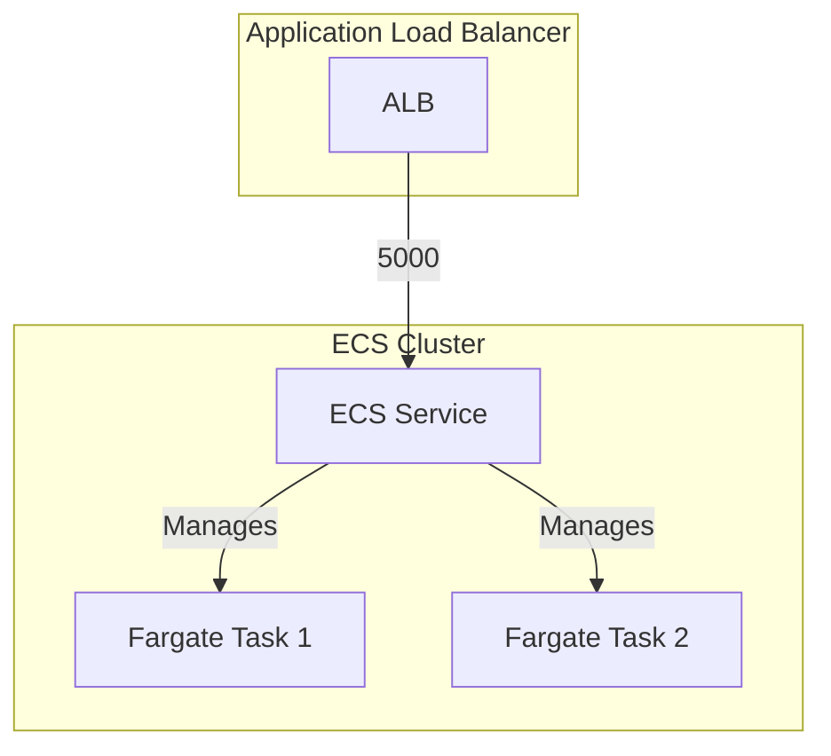

# ECS Fargate Service Example

This example demonstrates how to deploy a simple web service using Amazon ECS Fargate with an Application Load Balancer (ALB) in AWS. The service runs a containerized web application and automatically scales based on demand.

## Usage

To deploy this example:

1. Navigate to the example directory:

   ```bash
   cd examples/terragrunt/units/ecs-fargate-service
   ```

2. Run the following command to deploy the service:

   ```bash
   terragrunt apply
   ```

3. After deployment, you can access the service through the ALB's DNS name, which will be shown in the output.

   ```bash
   terragrunt output
   ```

## Estimated Time to Deploy

In a local test, the service took about 2-3 minutes to startup after applying, as ECS Fargate needs to pull the container image and start the containers.

## Architecture

The example deploys:

- An ECS Fargate cluster
- A Fargate service running the web application
- An Application Load Balancer to distribute traffic
- Security groups for the ALB and Fargate tasks
- IAM roles and policies for the ECS tasks

## Configuration

The example is configured through `terragrunt.hcl` with the following parameters:

| Parameter | Description | Default |
|-----------|-------------|---------|
| `name` | Name of the service and associated resources | `ecs-fargate-service` |
| `container_port` | Port on which the container listens | `5000` |
| `alb_port` | Port on which the ALB listens | `80` |
| `cpu` | CPU units for the Fargate task | `256` |
| `memory` | Memory for the Fargate task (MiB) | `512` |
| `desired_count` | Number of tasks to run | `2` |

## Implementation Details

The service runs a containerized web application using the `training/webapp` image. The configuration includes:

1. Container definition with memory limits and port mappings
2. Environment variables for the application
3. Fargate service configuration for automatic scaling
4. Application Load Balancer integration

## Infrastructure Diagram



Components:

- Application Load Balancer listening on port 80 and forwarding traffic to the Fargate tasks on port 5000
- ECS Cluster containing the service and tasks
- ECS Service managing the Fargate tasks
- ECS Fargate tasks running the web application
- IAM roles and policies for the ECS tasks

## Cleanup

When you're done testing, you can destroy the infrastructure:

```bash
terragrunt stack run destroy
```
