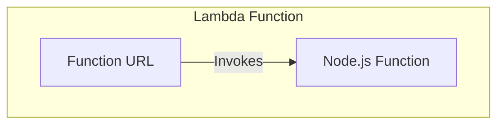

# Lambda Service Example

This example demonstrates how to deploy a simple web service using AWS Lambda with Function URL integration. The service runs a Node.js function that responds to HTTP requests.

## Usage

To deploy this example:

1. Navigate to the example directory:

   ```bash
   cd examples/terragrunt/units/lambda-service
   ```

2. Run the following command to deploy the service:

   ```bash
   terragrunt apply
   ```

3. After deployment, you can access the service through the Lambda Function URL, which will be shown in the output.

   ```bash
   terragrunt output
   ```

## Estimated Time to Deploy

In a local test, the service took about 30-45 seconds to startup after applying, as Lambda functions are typically provisioned quickly.

## Architecture

The example deploys:

- An AWS Lambda function running Node.js 22.x
- A Lambda Function URL endpoint
- IAM roles and policies for the Lambda function
- Necessary permissions for the Function URL to invoke the Lambda

## Configuration

The example is configured through `terragrunt.hcl` with the following parameters:

| Parameter            | Description                                  | Default                       |
|----------------------|----------------------------------------------|-------------------------------|
| `name`               | Name of the service and associated resources | `lambda-service-unit-example` |
| `runtime`            | Lambda function runtime                      | `nodejs22.x`                  |
| `handler`            | Lambda function handler                      | `index.handler`               |
| `authorization_type` | Lambda Function URL authorization type       | `NONE`                        |
| `zip_file`           | Path to the Lambda function package          | `package.zip`                 |

## Implementation Details

The service runs a Node.js Lambda function that is packaged using a custom packaging script. The configuration includes:

1. Lambda function definition with runtime and handler configuration
2. Lambda Function URL for direct HTTP access
3. Automatic packaging of the Lambda function code
4. IAM roles and policies for secure execution

## Infrastructure Diagram



Components:

- Lambda Function URL endpoint for direct HTTP access
- Lambda function running Node.js 22.x runtime
- IAM roles and policies for the Lambda function
- Custom packaging script for building the Lambda deployment package

## Cleanup

When you're done testing, you can destroy the infrastructure:

```bash
terragrunt stack run destroy
```
